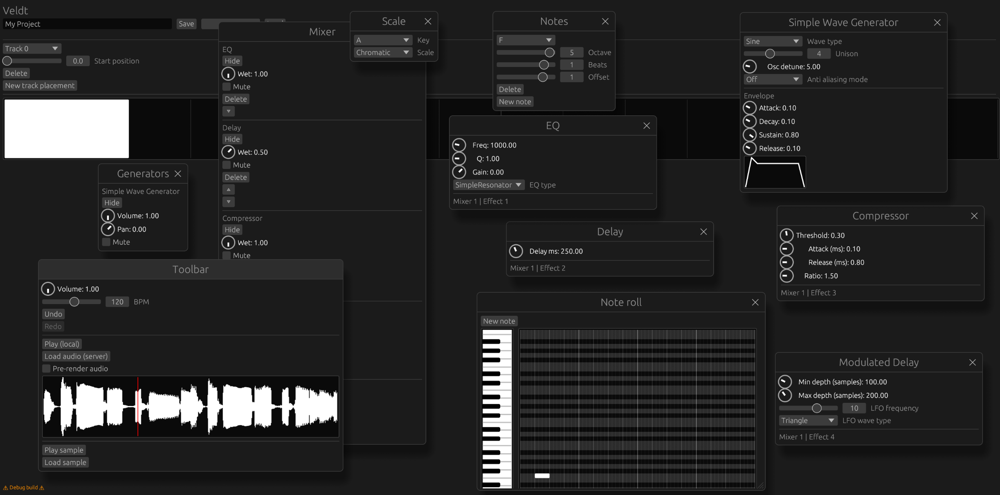

# veldt

Web-based digital audio workstation built in Rust



## Structure

* `hydric/` front end
* `mesic/` synthesis engine
* `xeric/` back end

...yes, the three app layers are named after [habitat classifications](https://en.wikipedia.org/wiki/Mesic_habitat) :)

* `shared/` contains the data model
* `state/` contains the state store, which contains all of the application state that is relevant to undo/redo. This includes all of the project state, but excludes things like window states.

## Architecture

Hydric is a egui web app, which runs in Wasm. This means it's single threaded, limited to 4GB of RAM, and has limited access to OS APIs like the filesystem. Hydric is just the UI: it talks to mesic in order to make synthesis happen.

Mesic needs to run in both a Wasm context - when it's running directly in a browser and talking to hydric - as well as generic server context when it's communicating with xeric, the server. It is therefore agnostic as to the specific build target.

Mesic encapsulates all of the audio processing logic needed by the app. The data model is symmetrically used by both the server and client - so mesic running on the server can handle rendering out audio just as it can on the client.

There are some limitations to be aware of when working with Wasm:
* Tokio doesn't work. Anything multi-threaded *especially* doesn't work.
* Communication with the server needs to account for CORS.
* Some dependencies aren't Wasm-friendly. Default features need to be disabled, or sometimes the dependencies can't be used at all.
* The client has only 4 GB of memory.

## Install dependencies

```
# Protobuf compiler
apt install -y protobuf-compiler # OS dependent, see https://grpc.io/docs/protoc-installation/

# Yarn (used for easy pre-commit hooks and other commands only)
sudo npm i -g yarn
# Note: on Linux you may have the "wrong yarn" to begin with.
# If this happens, uninstall it: https://stackoverflow.com/questions/53471063/yarn-error-there-are-no-scenarios-must-have-at-least-one

# Yarn deps
yarn

# Rust
curl --proto '=https' --tlsv1.2 -sSf https://sh.rustup.rs | sh # Or see https://www.rust-lang.org/tools/install
# Then run `rustup` and follow instructions to install latest rust.

# Wasm target
rustup target add wasm32-unknown-unknown

# Clippy
rustup component add clippy

# Wasm-bindgen, for building hydric
cargo install wasm-bindgen-cli
```

## Commands

```
# Pre-commit hook (will also run automatically before each commit)
yarn p

# Building
yarn b # everything
yarn hb # hydric
yarn mb # mesic
yarn sb # shared
yarn stb # state
yarn xb # xeric

# Running
yarn r # everything (hydric and xeric)
yarn hr # hydric - note: visit localhost:8080
yarn xr # xeric
# Note: `yarn xr` / `yarn r` sets RUST_LOG=trace for xeric.
# Without this, you won't get logs.
# Note: mesic, shared, and state can't be run as they're libraries.
# They get built by implication when hydric/xeric are run.

# Lint
yarn hl # hydric
yarn ml # mesic
yarn sl # shared
yarn st # state
yarn xl # xeric
yarn l # all

# Testing
yarn t # everything (currently excluding Hydric)
yarn mt # mesic
yarn st # shared
yarn stt # state
yarn xt # xeric
```
